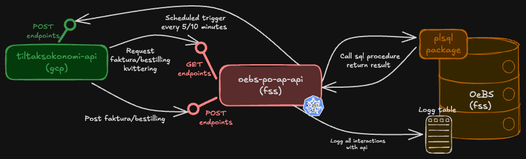

# oebs-po-ap-api

Middleware service between **tiltaksokonomi** (team-mulighetsrommet) and the **OEBS Oracle database** (Oracle E-Business Suite).

The service handles data flow in both directions:
- Receives bestilling and faktura data from tiltaksokonomi and stores it in OEBS via PL/SQL stored procedures
- Runs daily scheduled jobs that fetch bestillingskvitteringer and fakturakvitteringer from OEBS and push them back to tiltaksokonomi
- Exposes GET endpoints for querying kvittering data directly from OEBS

All communication is secured with Azure AD and logged to OEBS via `KallLogg`.

---

## Architecture

The service acts as a middleware between tiltaksokonomi and the OEBS Oracle database.
Tiltaksokonomi posts bestilling and faktura data to OEBS via POST endpoints exposed by this service.
The service also runs two scheduled jobs that fetch bestillingskvitteringer and fakturakvitteringer from OEBS via PL/SQL and forward them to tiltaksokonomi via REST.
Additionally, the service exposes GET endpoints that allow consumers to query kvittering data directly from OEBS.

---

## Functionality

### Instances and OEBS environments

The service runs with two instances: q1 and prod.

- **q1** runs in `dev-fss`, cluster `dev-fss`, using the `trygdeetaten.no` Azure AD tenant.
- **prod** runs in `prod-fss`, using the `nav.no` Azure AD tenant.

Deployment order: **q1 → prod**. Production deployment requires manual approval via `workflow_dispatch`.

### Data flow

All requests and responses are logged to the OEBS database table via `KallLogg`, including correlation ID, timestamps, duration, and status codes.

The service handles three data flow directions:

- **Inbound** — tiltaksokonomi sends bestilling and faktura data to OEBS via POST endpoints
- **Outbound (scheduled)** — two daily jobs fetch kvitteringer from OEBS via PL/SQL and push them to tiltaksokonomi
- **Query** — consumers can query kvittering data directly via GET endpoints

#### Inbound flow — tiltaksokonomi → OEBS

tiltaksokonomi posts bestilling and faktura data to OEBS via POST endpoints:

| Endpoint | Description |
|----------|-------------|
| `POST /api/v1/bestilling` | Receives bestilling data and stores it in OEBS via PL/SQL |
| `POST /api/v1/faktura` | Receives faktura data and stores it in OEBS via PL/SQL |

#### Outbound scheduled flow — OEBS → tiltaksokonomi

Two scheduled jobs run daily and push kvitteringer from OEBS to tiltaksokonomi:

| Job | Description |
|-----|-------------|
| `ScheduledTaskBestilling` | Fetches bestillingskvitteringer from OEBS and POSTs them to tiltaksokonomi |
| `ScheduledTaskFaktura` | Fetches fakturakvitteringer from OEBS and POSTs them to tiltaksokonomi |

#### Query flow — consumers → OEBS

Consumers can query kvittering data directly via GET endpoints:

| Endpoint | Description |
|----------|-------------|
| `GET /api/v1/bestillingskvittering` | Fetches bestillingstransaksjoner for a given `org_id` and `po_number` |
| `GET /api/v1/fakturakvittering` | Fetches fakturatransaksjoner for a given `org_id` and `faktura_num` |

### OEBS PL/SQL procedures

Install script for PL/SQL procedures can be found in the oebs repository
[install_oebs_1434_po_ap.sh](https://github.com/navikt/oebs/blob/main/install/install_oebs_1434_po_ap.sh)

---

## Dependencies

| System | Purpose                                                                        |
|--------|--------------------------------------------------------------------------------|
| **OEBS Oracle Database** | Source and target for all business data; accessed via PL/SQL stored procedures |
| **tiltaksokonomi** (team-mulighetsrommet) | Consumer of bestilling/faktura APIs and target for scheduled kvittering push   |
| **Azure AD** | OAuth2/JWT security via `no.nav.security:token-validation-spring`              |
| **NAIS platform** | Container orchestration, secrets management, and deployment                    |

### Consumers
The only consumer of this service is team-mulighetsroms service `tiltaksokonomi`, which is an internal NAV service.
Changes that requires updates on the consumer side (e.g. new endpoints, changes to request/response formats, etc.) must be coordinated
with team-mulighetsrom in the slack channel [samarbeid-valp-oebs](https://nav-it.slack.com/archives/C07HA39HQ3G).

---

## Running Locally

To run the service locally, use the `local` profile and set the following environment variables. Values for all secrets can be retrieved from the NAIS console for the application `oebs-po-ap-q1`:

- `DB_USERNAME` – username for OEBS
- `DB_PASSWORD` – password for OEBS
- `DB_URL` – URL for OEBS, find in https://confluence.adeo.no/spaces/ITO/pages/39159672/OeBS+Oversikt+over+milj%C3%B8er
- `AZURE_APP_WELL_KNOWN_URL` – discovery URL for the Azure AD app

You must also have connectivity to the OEBS database in the secure zone.
You can either use **vdi-utvikler-oebs** (a VDI set up for development in the secure zone) or the **Global Secure Access Client**.
For more information, see the [oebs access documentation](https://navikt.github.io/oksty-documentation/docs/team-oebs/oebs-access).

[Swagger UI](http://localhost:8080/swagger-ui/index.html) is available when running locally,
but all endpoints are protected by Azure AD by default. To test endpoints without authentication,
replace the `@Protected` annotation in a controller with `@Unprotected` for one of the GET endpoints.

---

## Testing

Unit tests are set up using JUnit and Mockito. No integration tests are currently configured.

---

## Monitoring and Alerting

Standard application monitoring is available via Grafana dashboards:
- [Grafana dashboard for q1](https://grafana.nav.cloud.nais.io/a/nais-apm-app/services/team-oebs/oebs-po-ap-api-q1?namespace=team-oebs&environment=dev-fss)
- [Grafana dashboard for prod](https://grafana.nav.cloud.nais.io/a/nais-apm-app/services/team-oebs/oebs-po-ap-api?namespace=team-oebs&environment=prod-fss)

---

## Deploy

### Branching strategy
- Feature development should happen on dedicated branches with a PR to `main`.
- Merging to `main` triggers automatic deployment to **q1**.
- Deployment to **prod** requires manual trigger via `workflow_dispatch` in GitHub Actions.

### Referencing Jira tasks
Include the Jira task key in the branch name and/or commit message. All PRs are squash-merged into main, so the most important thing is that the Jira issue is referenced in the squash commit message and that the PR title references the Jira issue.
For example, if working on `OEBS-123`, the commit message should include `feat(OEBS-123): new rest endpoint` and the PR title should follow the same format.
If a PR covers multiple Jira issues, all should be referenced, e.g. `feat(OEBS-123, OEBS-124): new rest endpoint and tests`.
All individual commits should be listed in the PR description.

### Deployment pipeline
Deployments are handled by GitHub Actions (`.github/workflows/build-deploy-oebs-po-ap-api.yaml`).

### Promotion criteria
Before deploying to production:
- All tests must pass (`mvn verify`).
- SonarCloud analysis must not introduce new critical issues.

---

## Documentation

### Swagger / OpenAPI
Swagger UI is available when the application is running:

- [Swagger q1](https://oebs-po-ap-api-q1.intern.dev.nav.no/swagger-ui/index.html#/)
- [Swagger prod](https://oebs-po-ap-api.intern.nav.no/swagger-ui/index.html#/)

### Confluence 
No additional documentation is available.